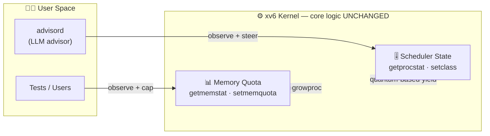
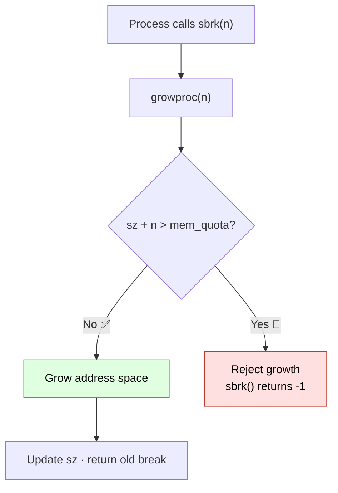
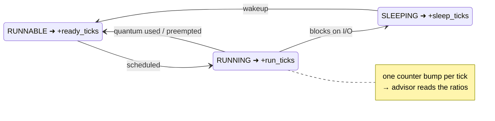
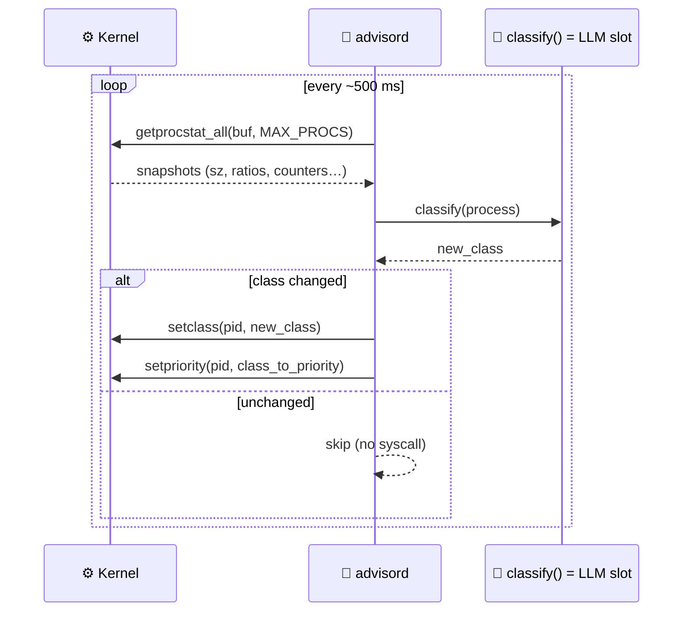
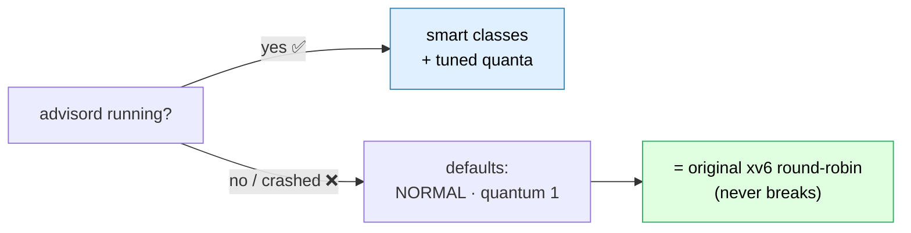
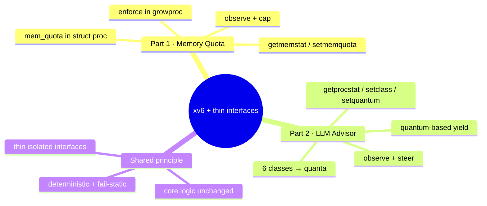

# Week 10 Presentation

This week's work covers two complementary additions to our xv6-based kernel:

1. **Per-Process Memory Quota** — let the kernel report and cap each process's memory use.
2. **LLM Advisor Interface for the Scheduler** — expose per-process scheduling state so an external advisor can reclassify processes without touching the kernel fast path.

Both share the same philosophy: the kernel keeps doing its own job unchanged, and we only add the ability to *observe* and *steer* it through small, well-isolated interfaces.



> **One idea, two interfaces:** *observe* + *cap/steer* from the outside, while the kernel's hot path stays untouched.

---

## Part 1 — Per-Process Memory Quota

### Goal

Make per-process memory usage **observable** and **enforceable**: anyone (a user, a test, or an advisor) should be able to read how much memory a process uses and set a hard ceiling on it.

### Features

- **`getmemstat` syscall** — report a process's current memory footprint (e.g. `sz`) and its configured quota.
- **`setmemquota` syscall** — set a per-process memory limit.
- **`mem_quota` field in `struct proc`** — each process carries its own quota.
- **Quota enforcement in `growproc`** — when a process grows its address space, the kernel checks the request against the quota; if it would exceed the limit, the growth fails and `sbrk()` returns an error.

### How it behaves

- A process can query its own (or another process's) memory usage and limit at any time.
- A limit can be attached to a specific process.
- Once usage reaches the quota, further allocation via `sbrk()` is rejected instead of silently growing.



### Validation

Two small programs exercise the feature:

- **`memstress`** — repeatedly allocates memory to push a process toward (and past) its quota.
- **`memstat_test`** — reads back `sz` and `quota` to confirm the kernel's accounting is correct.

The acceptance criteria are simple and directly testable:

| Question | Verified by |
|---|---|
| Can we see per-process memory usage? | `getmemstat` / `memstat_test` |
| Can we set a memory cap on a specific process? | `setmemquota` |
| Does `sbrk()` fail once the quota is exceeded? | `memstress` before vs. after a quota is applied |

The experiment compares `memstress` logs **before** and **after** a quota is applied to show that allocation succeeds freely without a limit and is cut off once the limit is in place.

```text
 memory used (KB)
   │
   │  BEFORE quota                 AFTER quota = ▒▒ ceiling
   │  ▇▇▇▇▇▇▇▇▇▇▇▇▇▇▇▇  keeps      ▇▇▇▇▇▇▒▒▒▒▒▒▒▒▒▒  sbrk() → -1
   │  ▇▇▇▇▇▇▇▇▇▇▇▇▇▇▇▇  growing    ▇▇▇▇▇▇░░░░░░░░░░  blocked at cap
   │  ▇▇▇▇▇▇▇▇▇▇▇▇▇▇▇▇             ▇▇▇▇▇▇░░░░░░░░░░
   └───────────────────────────────────────────────▶ alloc attempts
        (unbounded)                   (capped)
```

---

## Part 2 — LLM Advisor Interface for the Scheduler

### Goal

Build the **kernel half** of an "xv6 with an LLM advisor sitting next to it." The kernel keeps its existing scheduling logic; we only add the policy state and syscalls an external advisor needs to read that state and nudge it. The core idea: *the kernel functions stay the same — only the quality of the values they read changes.*

### What the kernel now exposes

- **New per-process policy state** — alongside the existing `priority`, each process gains a **class** (`class_id`) and a **time-slice length** (`quantum_ticks`), plus lightweight counters.
- **A `procstat` snapshot** shared between kernel and user space, carrying everything an advisor needs in one struct:

  ```c
  struct procstat {
    int pid, ppid, state, priority, class_id, quantum_ticks;
    uint64 ready_ticks, run_ticks, sleep_ticks, ctxsw_count, lifetime;
    char name[16];
  };
  ```

- **Six process classes** — `INTERACTIVE / IO_BOUND / NORMAL / CPU_BOUND / BATCH / SYSTEM`.
- **A class → default time-slice mapping** (the kernel's single piece of policy):

  ```text
  quantum (ticks)   0   1   2   3   4   5   6   7   8
  INTERACTIVE   ▏ █                                     1  ← latency first
  IO_BOUND      ▏ █                                     1  ← sleeps often
  NORMAL        ▏ █                                     1  ← original xv6
  SYSTEM        ▏ ██                                    2  ← short + headroom
  CPU_BOUND     ▏ ████                                  4  ← fewer ctx switches
  BATCH         ▏ ████████                              8  ← throughput first
  ```

  | Class | Quantum (ticks) | Rationale |
  |---|---|---|
  | INTERACTIVE | 1 | Latency first — yield every tick |
  | IO_BOUND | 1 | Sleeps often, no need for a longer slice |
  | NORMAL | 1 | Identical to original xv6 |
  | CPU_BOUND | 4 | Fewer context switches |
  | BATCH | 8 | Background throughput first |
  | SYSTEM | 2 | Short, with a little headroom |

### New syscalls

| Signature | Role |
|---|---|
| `int setclass(int pid, int class_id)` | Set a process's class and sync its default quantum |
| `int setquantum(int pid, int q)` | Override only the quantum (1..64) |
| `int getprocstat(int pid, struct procstat *out)` | Snapshot of one process |
| `int getprocstat_all(struct procstat *arr, int max)` | Snapshot of every active process |

The existing `getpriority` / `setpriority` are kept and used as-is. `setclass` is deliberately separated from priority changes so class and priority can be steered independently.

### Tick accounting (kept cheap)

Once per timer tick, the kernel samples each process's state and bumps a single counter — `ready_ticks` while RUNNABLE, `run_ticks` while RUNNING, `sleep_ticks` while SLEEPING. This sampling approach is intentionally lightweight (one pass per tick) and gives the advisor enough resolution (~100 ms) to classify processes on a ~500 ms cadence.



### Variable time-slice (quantum-based yield)

The timer's yield decision now checks `slice_used >= quantum_ticks` instead of yielding unconditionally. With the default quantum of 1, behavior is **bit-for-bit identical to original xv6**. A CPU-bound process raised to quantum 4 yields only every fourth tick, cutting its context-switch rate to a quarter — exactly the throughput win we want for batch-style work.

```text
tick →   1   2   3   4   5   6   7   8
quantum 1  ↻   ↻   ↻   ↻   ↻   ↻   ↻   ↻     8 context switches  (vanilla xv6)
quantum 4  ·   ·   ·   ↻   ·   ·   ·   ↻     2 context switches  (¼ the rate)

  ↻ = yield / context switch      · = keep running
```

### The advisor daemon (`advisord`)

A user-space demo daemon ties it together with a simple polling loop:

```
loop {
  n = getprocstat_all(buf, MAX_PROCS);
  for each process in buf:
    new_class = classify(process);   // <- this is where an LLM call would go
    if (new_class != current class) {
      setclass(pid, new_class);
      setpriority(pid, class_to_priority(new_class));
    }
  pause(~500ms);
}
```



The `classify()` function is the **placeholder for the LLM**. Today it's a simple heuristic (sleep/run ratio + name matching), but because the interface is cleanly separated, swapping in a real LLM call requires **no kernel changes**. Safety guards keep the daemon from reclassifying itself or critical processes (`init`, `sh`).

A companion inspector, **`advstat`**, dumps the same `procstat` snapshot for humans, so a person can see exactly what the advisor sees and verify its decisions.

### Design guarantees

- **Fast path unchanged** — `scheduler()`, `sched()`, `swtch()`, `sleep`/`wakeup`, and fork's RUNNABLE transition are untouched; we only added a couple of counter writes and one branch.
- **Only policy-state quality changes** — the kernel never interprets a class; meaning lives entirely in user space.
- **Deterministic-recoverable** — every advisor syscall is a simple value write, so a deterministic classifier yields a deterministic system.
- **Fail-static** — if `advisord` never starts or dies, every process defaults to `NORMAL` / quantum 1, i.e. the original RR scheduling keeps working.
- **Observable** — `^P` (procdump), `advstat`, and `getprocstat_all` all surface the same data.



### Intentionally out of scope (next steps)

Multi-level feedback queues, aging boost, a panic-time ring buffer for post-mortem analysis, automatic fork-rate demotion, and cross-instance lifetime caching are all noted as follow-up work — the kernel exposes the data; the smarter policy lives in future user-space iterations of the advisor.

---

## Summary



| | Part 1: Memory Quota | Part 2: LLM Advisor Interface |
|---|---|---|
| **What it adds** | Per-process memory accounting + hard cap | Per-process scheduling state + syscalls for an external advisor |
| **Key syscalls** | `getmemstat`, `setmemquota` | `setclass`, `setquantum`, `getprocstat`, `getprocstat_all` |
| **Enforcement point** | `growproc` (rejects over-quota `sbrk()`) | Quantum-based yield in the timer path |
| **Shared principle** | Observe + cap without changing core behavior | Observe + steer without touching the fast path |

Both parts leave the kernel's existing behavior intact and add only thin, isolated interfaces — so the system stays correct and deterministic by default, while gaining the ability to be observed and guided from outside.
